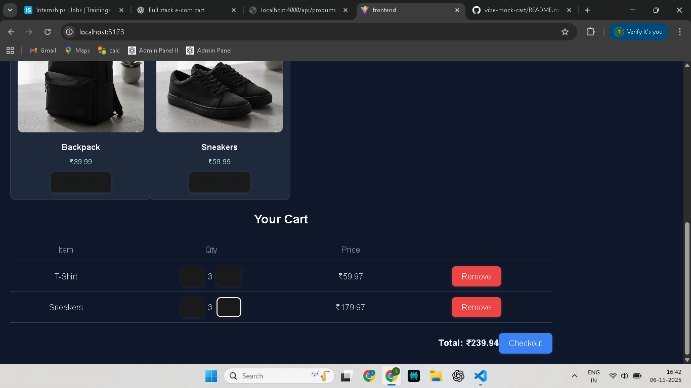

# 🛒 Vibe Commerce – Full Stack E-Commerce Cart

A full-stack shopping cart web app built for the **Vibe Commerce Internship Assignment (November 2025)**.  
It demonstrates a basic e-commerce workflow — products, cart management, checkout, and mock receipt generation.

---

## 🚀 Tech Stack
- **Frontend:** React (Vite)
- **Backend:** Node.js + Express
- **Database (optional):** SQLite / MongoDB
- **Styling:** Custom CSS (Dark Theme)
- **Runtime:** Node 20+
- **API Type:** REST

---

## 🧩 Features
✅ Product grid with your own uploaded images  
✅ Add / Remove / Update (±) cart items  
✅ View cart with live total and item list  
✅ Checkout form + receipt modal (mock order confirmation)  
✅ Error handling banner for failed API calls  
✅ Fully responsive layout (mobile → desktop)  
✅ Bonus-ready: SQLite persistence or Fake Store API integration  

---

## ⚙️ Setup Instructions

### 🖥 Backend

```bash
cd backend
npm install
npm run dev
# Server: http://localhost:4000


### 💻 Frontend
bash
cd frontend
npm install
npm run dev

# App: http://localhost:5173


📦 API Endpoints
Method	Endpoint	Body	Description
GET	/api/products	—	Get list of products (mock or local)
GET	/api/cart	—	Get current cart & total
POST	/api/cart	{ "productId", "qty" }	Add/update item quantity (+/-)
DELETE	/api/cart/:id	—	Remove item by productId
POST	/api/checkout	{ name, email, cartItems }	Simulate checkout; returns receipt JSON

Tip: qty can be positive (increment) or negative (decrement).

## 🧾 Demo

🎥 **Demo Video:** https://youtu.be/IXhd_nrtYOE

🖼 **Screenshots**  
Add images in a `/docs` folder, then reference them like this:





---

## 🧱 Folder Structure

vibe-mock-cart/
 ├─ backend/
 │  ├─ server.js
 │  ├─ package.json
 │  └─ db.js (optional SQLite persistence)
 ├─ frontend/
 │  ├─ public/uploads/        # product images
 │  └─ src/
 │     ├─ App.jsx
 │     ├─ CheckoutModal.jsx
 │     └─ style.css
 │  └─ package.json
 ├─ docs/                     # screenshots
 └─ README.md

---

## 💡 Bonus Implementations (Optional)

- Persistent cart storage using **SQLite**
- Dynamic product fetching from **Fake Store API**
- Navbar with live cart item count
- Hover zoom & animation on product cards

---

## 🧑‍💻 Author

**Sathish Routhu**  
🗓️ November 2025  
📍 Built as part of the **Vibe Commerce Internship Screening Assignment**
